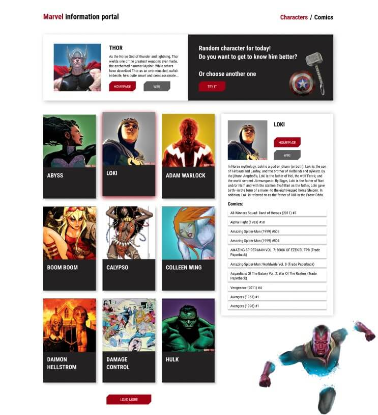

# 🕸️ Marvel API Explorer 🚀


---

## ✨ Project Overview

Welcome to **Marvel API Explorer**! This web application serves as your interactive portal into the thrilling Marvel Universe. It allows you to explore the vast library of Marvel characters, comics, series, and events by utilizing the official Marvel Comics API.

Discover your favorite heroes, browse comic details, and dive into epic sagas through a user-friendly interface designed for performance and visual appeal.

---

## 📸 Screenshots / Demo



---

## 🌟 Key Features

* **🔍 Search Functionality:** Quickly find specific characters or comics by name.
* **🃏 Interactive Cards:** View key information about Marvel entities presented in engaging card layouts.
* **📖 Detail View:** Dive deeper into any selected character or comic with expanded descriptions and related content.
* **🌐 Pagination:** Effortlessly navigate through large volumes of Marvel data.
* **🎨 Clean Design:** Built with standard CSS for a straightforward and responsive aesthetic.

---

## 💻 Tech Stack

* **Front-end:**
    * [React](https://react.dev/) - For building the component-based user interface.
    * [Vite](https://vitejs.dev/) - A blazing-fast build tool for rapid development and hot module replacement.
* **Styling:**
    * CSS - For custom styling and layout.

---

## 🚀 Getting Started

Follow these steps to get the project up and running on your local machine.

### 📋 Prerequisites

* [Node.js](https://nodejs.org/en/) (LTS version 18+ or 20+ recommended)
* [npm](https://www.npmjs.com/) (comes with Node.js)
* [Git](https://git-scm.com/)

### 🔑 Marvel API Key Setup

To fetch data from the Marvel API, you'll need to obtain your Public and Private API keys.

1.  Visit the [Marvel Developers site](https://developer.marvel.com/).
2.  Register or log in to your account.
3.  Obtain your `Public Key` and `Private Key`.
4.  Create a file named `.env` in the root directory of your project (where `package.json` is located).
5.  Add your keys to this file. **⚠️ IMPORTANT:** Never expose your `MARVEL_PRIVATE_KEY` directly in client-side code in a production environment. For this learning project, you might compute the hash client-side, but in a real-world application, a backend proxy is highly recommended to handle this.

    ```
    VITE_MARVEL_PUBLIC_KEY=YOUR_PUBLIC_KEY_HERE
    VITE_MARVEL_PRIVATE_KEY=YOUR_PRIVATE_KEY_HERE
    ```

### 🛠️ Installation

1.  **Clone the repository:**
    ```bash
    git clone https://github.com/VolodX/marvel-api-explorer.git
    ```

2.  **Navigate into the project directory:**
    ```bash
    cd marvel-api-explorer
    ```

3.  **Install dependencies:**
    ```bash
    npm install
    ```

### ▶️ Running the Application

```bash
npm run dev
```

## 🚀 Local Development

The application will be available at [http://localhost:5173/](http://localhost:5173/)  
(or another port indicated in your terminal).

---

## 🤝 Contributing

Contributions are welcome! If you have ideas for improvements or find any bugs, please feel free to:

1. Fork the repository  
2. Create a new branch  
	 ```bash
	 git checkout -b feature/AmazingFeature
	 ```
3. Commit your changes  
	 ```bash
	 git commit -m 'Add some AmazingFeature'
	 ```
4. Push to your branch  
	 ```bash
	 git push origin feature/AmazingFeature
	 ```
5. Open a Pull Request

---

## 📄 License

This project is licensed under the **MIT License**.  
See the [LICENSE](./LICENSE) file for more details.

---

## ✉️ Contact

**VolodX** – [https://github.com/VolodX](https://github.com/VolodX)  
📧 Email: [bigv096@gmail.com](mailto:bigv096@gmail.com)
